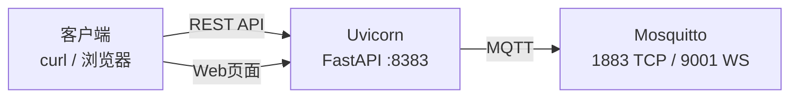

# MQTT 推送中心

基于 FastAPI + Mosquitto 的 MQTT 消息推送服务，提供 Web 管理界面和 REST API。

## 架构



- **Uvicorn** (`Port 8383`) — 提供 Web 页面和 REST API
- **Mosquitto** (`Port 1883` TCP, `Port 9001` WebSocket) — MQTT 消息代理

## 快速开始

启动后访问 `http://<host>:8383` 即可打开管理页面。

### 自定义端口

通过环境变量修改端口：
`docker-compose.yml` 的 `environment` 中直接修改：

```yaml
environment:
  - MQTT_WS_PORT=8080
  - UVICORN_PORT=8888
```

## API 接口

### `POST /api/push` — 推送消息

**请求体：**

```json
{
  "server_name": "server-1",
  "topic": "test/topic",
  "message": "你好，世界",
  "push_to_mqtt": true,
  "msg_type": "markdown",
  "mode": "append"
}
```

| 字段 | 类型 | 必填 | 说明 |
|------|------|------|------|
| `server_name` | string | 是 | 来源服务器名称 |
| `topic` | string | 是 | MQTT 主题 |
| `message` | string | 是 | 消息内容（支持 Markdown） |
| `push_to_mqtt` | bool | 是 | 是否推送到 MQTT（传 `true`/`false`，**不带引号**） |
| `msg_type` | string | 否 | 消息类型，固定 `"markdown"` |
| `mode` | string | 否 | `"append"`（持续追加，默认）或 `"overwrite"`（覆盖同一 topic） |

**响应：**

```json
{
  "code": 200,
  "record_id": 1,
  "detail": "消息已投递至 MQTT"
}
```

### `POST /api/repush` — 重新推送

```json
{
  "server_name": "server-1",
  "id": 1
}
```

### `GET /records` — 查询历史

```
GET /records?server_name=server-1&topic=test&limit=50&offset=0
```

| 参数 | 类型 | 默认 | 说明 |
|------|------|------|------|
| `server_name` | string | — | 按服务器筛选 |
| `topic` | string | — | 按主题筛选（模糊匹配） |
| `limit` | int | 100 | 返回条数（1-500） |
| `offset` | int | 0 | 偏移量 |

### `GET /api/health` — 健康检查

```json
{ "status": "running" }
```

## 目录结构

```
.
├── docker-compose.yml       # 容器编排配置
├── Dockerfile                # 镜像构建
├── 容器构建脚本/
│   ├── init-components.sh    # 构建时初始化（下载 7z、应用文件）
│   └── start.sh              # 容器入口脚本（启动 mosquitto + uvicorn）
├── 容器相关脚本/
│   ├── main.py               # FastAPI 应用
│   └── index.html            # Web 管理页面
└── data/                     # 运行时数据（自动创建）
    ├── main.py               # 应用文件（挂载自镜像）
    ├── static/index.html     # 前端页面（挂载自镜像）
    └── push_records/         # 推送记录 JSON 文件
```

## 数据存储

推送记录以 JSON 文件形式持久化在工作目录下，按 `server_name` 分文件存储，每个服务器最多保留 100 条记录。
